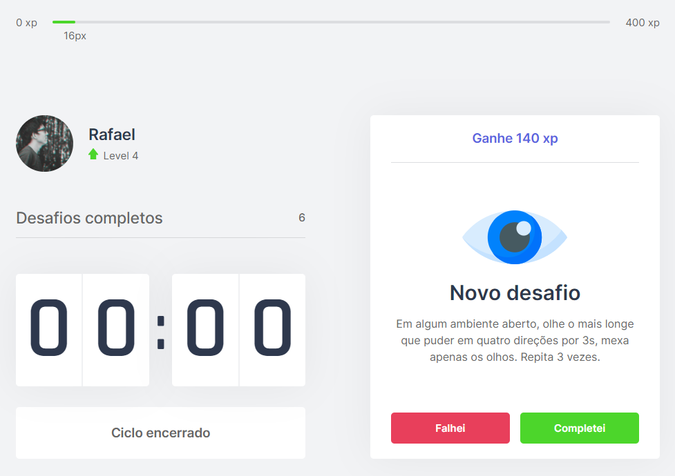

<h1 align="center">
  move.it
</h1>

<h3 align="center">
<strong>Next level Week 04</strong>
</h3>

<p align="center">

  
  
  
  
  <br>
  <br>
  <a href="#space_invader-technologies">Technologies</a> |
  <a href="#information_source-how-to-use">How to use</a>
  <br>
  <br>
  
  
  <br>
</p>

## :space_invader: Technologies

- React
- Typescript
- Next.js
- CSS

## :information_source: How to use

To run this project you'll need [GIT](https://git-scm.com/), [NodeJS](https://nodejs.org/en/) and [Yarn](https://yarnpkg.com/) installed on your computer.

```bash
# Clone this repository
$ git clone https://github.com/rafashiga/nlw04-moveit

# Go into the repository
$ cd nlw04-moveit

# Install dependencies
$ yarn

# Run the project
$ yarn dev
```
